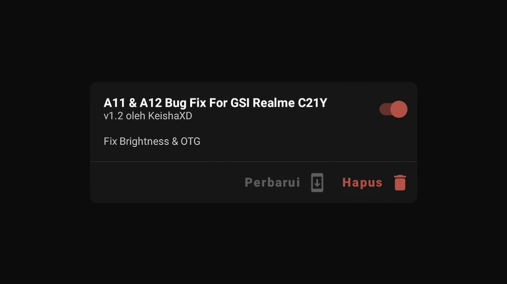

# Bug Fix for Realme C21Y

This module provides fixes for common issues found on Android 11 & Android 12 GSI Rom on the Realme C21Y device, specifically related to brightness and OTG functionality.

## Fixes :

1. **Brightness Issue**
   - Resolved issues with screen brightness not functioning properly or being unresponsive.
   - Improved stability for automatic and manual brightness adjustments.

2. **OTG Issue**
   - Fixed problems with OTG detection and functionality.
   - Ensured proper recognition of external USB devices.

## Download :
To download this module, please go to the [Release page](https://github.com/KeishaXD/A11-12-Bug-Fix-Realme-C21Y/releases)

## Disclaimer:
Use these fixes at your own risk. The contributors are not responsible for any potential damage to your device.
